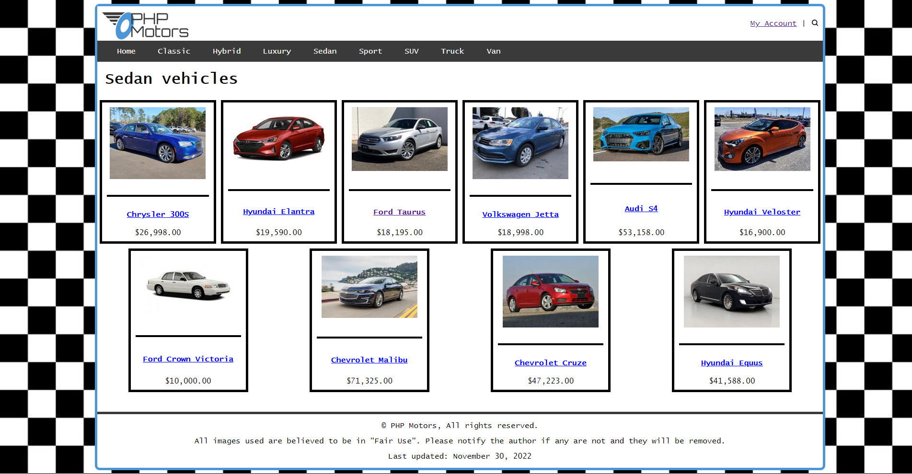
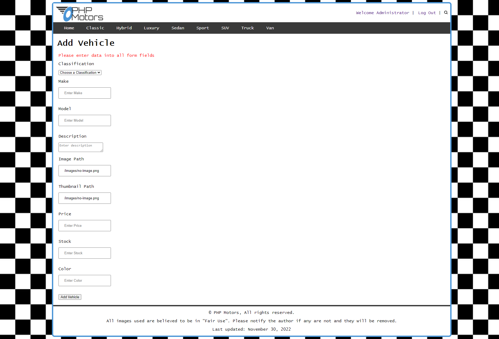

# PHP Motors

This is a project completed for my Web Backend class. All vehicle and account data is stored in a mySQL database

The website features a catalog of vehicles to choose from.

Clicking on any vehicle will show details about the vehicle.

The website features the ablility to log into an account.

An administrator page is available for account and vehicle inventory management.

Account information can be changed from the account managment page.

On the vehicle management page, a new vehicle can be added, or any existing vehicle can be modified or deleted.

All necessary information can be added to a vehicle.

A search page allows the user to quickly find a vehicle based on keywords.

